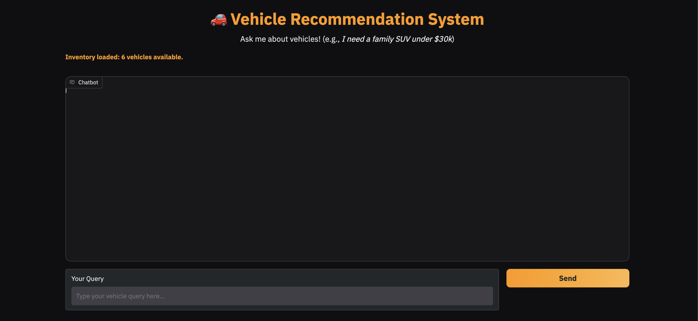

# 🚗 Vehicle Recommendation Agent

A multi-agent vehicle recommendation system with a beautiful Gradio-powered chat UI. Get personalized car suggestions based on your needs, budget, and preferences—powered by specialist agents and robust error handling.

---

## ✨ Features

- **Conversational Chatbot UI**: Modern, dark-themed Gradio interface with orange highlights.
- **Multi-Agent Intelligence**: Specialist agents for budget, family, luxury, and eco-friendly vehicles.
- **Smart Query Routing**: Automatic selection of the best agent(s) for each user query.
- **Robust Error Handling**: Retries, timeouts, and graceful fallback responses.
- **Easy Deployment**: Ready for Hugging Face Spaces, local, or cloud deployment.

---
## Quick Demo
 You can try the live demo of the Vehicle Recommendation Agent on [Hugging Face Spaces](https://huggingface.co/spaces/DarshanR15/vehicle-recommendation-agent).

## 🚀 Quick Start

### 1. Clone the Repo
```sh
git clone https://github.com/yourusername/vehicle-recommendation-agent.git
cd vehicle-recommendation-agent
```

- Make sure you have UV installed
- Create an `.env` file with your API keys and configuration.
- Make sure to add `OPENAI_API_KEY=your_openai_key` to your `.env` file.

### 2. Sync Requirements
```sh
    uv sync
```

### 3. Run the App
```sh
uv run app/app.py
```

The Gradio UI will open in your browser. Ask anything about vehicles!

---

## 🛠️ Project Structure

```
app/
  ├── app.py                # Gradio UI entry point
  ├── tools.py              # Specialist search tools
  ├── vehicle_agents.py     # Agent definitions
  ├── inventory_cache.py    # Inventory caching system
  ├── error_handling.py     # Robust error handling
  ├── data/                 # Data and config files
  └── ...
pyproject.toml
README.md
```

---

## 🤖 How It Works

- **User** enters a query (e.g., "I need a family SUV under $30k").
- **vehicle_recommendation_agent** analyzes the query and routes it to the most relevant specialist agents.
- **Specialist agents** (budget, family, luxury, eco) search the inventory and return recommendations.
- **Chatbot** displays the best results with a friendly, interactive UI.

---

## 🌐 Deploy on Hugging Face Spaces

1. Push your code to GitHub.
2. Create a new Space on [Hugging Face Spaces](https://huggingface.co/spaces) (choose Gradio SDK).
3. Upload your code or link your repo.
4. Add any required secrets in the Space settings.
5. Enjoy your public vehicle recommendation chatbot!

---

## 💡 Example Questions

Here are some example questions you can ask the Vehicle Recommendation Agent:

1. I need a reliable family SUV under $40,000 with good safety ratings.
2. Show me all electric vehicles available in your inventory.
3. Which vehicles do you recommend for a daily city commute with great fuel efficiency?
4. List all luxury SUVs you have in stock.
5. What is the most affordable car with advanced safety features?
6. How many Toyota vehicles are currently available?
7. Do you have any 7-seater vehicles suitable for large families?
8. Show me vehicles available in red color.
9. Which cars have both sunroof and leather seats?
10. Can you summarize your current vehicle inventory?
11. Which electric vehicles are available in blue or white color?
12. List all hybrid vehicles with a budget below $35,000.
13. Are there any vehicles with adaptive cruise control?
14. What are the available colors for the Honda Accord?
15. List all 7-seater vehicles with a 5-star safety rating.

---

## 📸 Demo



---

## 📄 License

MIT License. See [LICENSE](LICENSE) for details.

---

## 🙏 Acknowledgements

- [Gradio](https://gradio.app/)
- [Hugging Face Spaces](https://huggingface.co/spaces)
- All open-source contributors

---